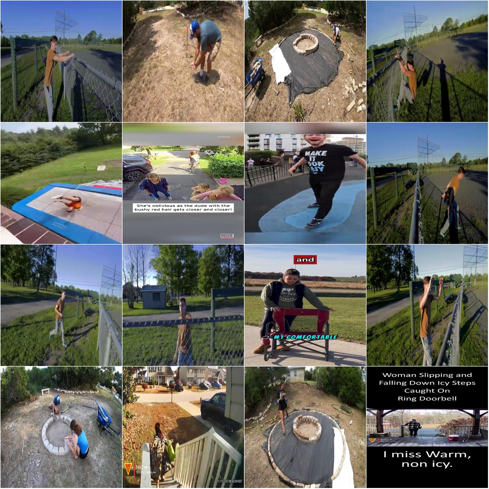

# Human Behavior Pose Detection Key Points Dataset in YOLO format with 505 images and 6 categories

Dataset format: YOLO key point format (Note that this is not target detection or segmentation YOLO, but merely contains JPG images and corresponding YOLO format TXT files)
Number of images (number of JPG files): 505
Number of labeled images (number of TXT files): 505
Training set size: 380
Validation set size: 75
Test set size: 50
Number of labeled categories: 6
Labeled key point counts: 12
Each category has the following number of bounding boxes:
fall (falling down) box count = 10
jump (jumping) box count = 27
s_wall (standing against a wall) box count = 72
sitting (sitting) box count = 135
standing (standing) box count = 263
walking (walking) box count = 124
Total bounding box count = 631
Image resolution: Multi-resolution images, such as 360x640, 640x360, etc.
Important note: The dataset has been split into training, validation, and testing sets, which can be directly used for training Yolov5-pose, Yolov8-pose, Yolov11-pose, or Yolov26-pose models.
Special declaration: This dataset does not guarantee the accuracy of the trained model or weight files.
Image preview:
Labeled example:
Original image (pick 16 images randomly):
Labeled drawing results:

## Images

Here is a pay link on Stripe ( https://buy.stripe.com/3cs8yP7sY87d0vu9AB ). Please contact me lonlonago@foxmail.com after funding $89, and I will send you a complete data files , thank you!

